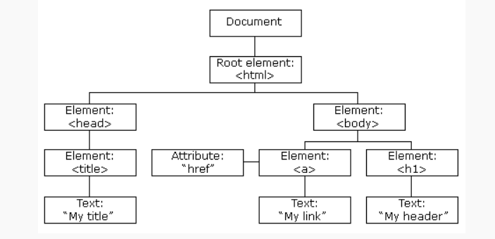

# JavaScript学习总结
## 1. JavaScript简介
JavaScript是前端三剑客之一，广泛应用于网页前端开发和后端开发的编程语言,能与html，css搭配让页面有更好的表现。
## 2. 基础语法
JavaScript的语法跟Java语言相似。  
**标识符：** 采用驼峰命名规则，且区分到小写。

**变量:** 使用`var`关键字声明变量，变量将成为的作用域中的局部变量。 比如`var name = Tom;`.

**数据类型** 
JavaScript有值类型:
- 字符串(string):用`""`括起来,如`"Hello"`
- 数值(number):如`1`、`3.14`
- 布尔(boolean):true或者false
- null: 'null'
- undefined: "undefined"
- Symbol

此外,JavaScript还有引用数据类型
- 对象(Object)
- 数组(Array)
- 函数(Function)


## 3. 操作符

JavaScript常用的操作符有:
- 算数操作符:`+`、`-、*、/、%`等
- 关系操作符:`>` 、`< 、>=、<=、==、!=`
- 布尔操作符:`&&`、`||`、`!`
- 条件操作符: `?`
- 赋值操作符:`=`、`+=、-=`等
  
## 4. 语句
- 条件判断语句: `if...else`和`switch`
- 循环语句:`for`、`while`和`do...while`进行循环
- `break`和`continue`: `break`用于跳出循环,`continue`仅跳出本次循环

## 5. 函数
不同于Java,Javascript函数可以不写返回类型，任何时候都可`return`,同时可用以下方式写函数:
- 关键字声明:使用`function`声明,花括号`{函数体}`
- 表达式:将一个函数赋值给一个变量,如:
    ```js
    const func = function() { 
        console.log('Hello');
    };
    ```
- 箭头函数:使函数更简洁,如:
`const sayHello = () => console.log('Hello');`

**函数参数**
JavaScript函数允许接受多个参数
支持默认参数值和剩余参数:
```js
function sum(a, b = 2) {  // b默认为2
  return a + b;
}

function sum(...nums) {   // nums会将多个参数统一为数组
  var total = 0;
  for (var n of nums) total += n;
  return total;
}
```
## 6. 对象
Javascript对象是具有数据和方法的集合。
- 构造方法
    ```  js
    function Person(name, age) {
        this.name = name;
        this.age = age;
        this.sayHello = function() {
            console.log("Hello!");
        } 
    }
    var obj = new Person("Tom", 18);
    ```
- 字面量
    ```js
    var obj = {
        name: "Tom",
        age: 18,
        sayHello: function() {
            console.log("Hello!");
        }
    };
    ```
## 7. 数组
Javascript数组是一组按顺序排列的对象，它可以包含任何类型的对象。同时，它的大小是动态调整的。

- new方法创建
  `var arr = new Array(1, 2, 3);`
- 字面量
  `var arr = [1, 2, 3]`  
**常用方法**
- `arr.push(elem)`:在数组的末尾添加一个元素。
- `arr.pop()`:从数组的末尾移除一个元素。
- `arr.shift()`:从数组的开头移除一个元素，并返回该项。
- `arr.unshift()`:在数组的开头添加任意个元素，返回新数组的长度。
- `arr.concat(arr2)`:连接 arr 和 arr2 ,返回一个新数组,原数组不变。
- `arr.slice(start, end)`:从数组中提取起始到结束的元素，不影响原数组。
- `arr.splice(start, delCount, ...items)`:从索引 start 开始删除 delCount 个元素,并插入 items,影响原数组。
- `arr.indexOf(elem)`:返回 elem 第一次出现的索引。如果不存在,返回 -1。
- `arr.lastIndexOf(elem)`:返回 elem 最后一次出现的索引。如果不存在,返回 -1。
- `arr.forEach(callback)`:对数组每个元素执行 callback 函数。
- `arr.map(callback)`:返回一个数组,包含 callback 函数返回值。

## 8. 链式语法
链式语法是每种方法调用都返回对象本身,这样就可以继续在结果上调用更多方法。这样使得代码更加简洁，如:
```js
    [1, 2, 3].push(4).pop().shift()  // 1
```

## 9. 闭包
函数能够访问其词法作用域（即定义时的作用域）以外的变量，这个词法作用域内的变量形成了一个“封闭环境”，它们在定义时被捕获，并一直保存到函数执行时使用。

```js
function makeAdder(x) {
  return function(y) {
    return x + y;
  };
}
var add5 = makeAdder(5);
var add10 = makeAdder(10);

console.log(add5(2));  //  7
console.log(add10(2)); //  12
```
## 10. DOM
DOM 是 HTML 和 XML 文档的编程接口。它提供了对文档的结构化表示。JavaScript 可以使用 DOM 来访问 HTML元素。


**查找元素**
- `document.getElementById(id)`:根据元素 ID 选择元素
- `document.getElementsByTagName(name)`:根据标签名选择元素
- `document.getElementsByClassName(class)`:根据类名选择元素
- `document.querySelector(cssSelector)`:根据 CSS 选择器选择元素
- `document.querySelectorAll(cssSelector)`:根据 CSS 选择器选择多个元素

**修改元素**
- `element.innerHTML`:改变元素的 HTML 内容
- `element.attribute`:改变元素的属性
- `element.style`:改变元素的样式
- `element.classList`:改变元素的CSS类,classList 属性是只读的，使用 add() 和 remove() 方法修改它。
- `element.appendChild(child)`:向元素添加子元素
- `element.removeChild(child)`:从元素移除子元素
- `element.replaceChild(newChild, oldChild)`:用一个新子元素替换一个子元素

**事件类型**
- `click`:当用户点击元素时触发
- `dblclick`:当用户双击元素时触发
- `mouseover`:当鼠标移动到元素上时触发
- `mouseout`:当鼠标移出元素时触发
- `keypress`:当用户按下键盘上的按键时触发
- `change`:当元素的值改变时触发

**添加事件**
在元素上使用 addEventListener() 方法
``` js
element.addEventListener("click", function(){
  console.log('Hello!'); 
});
```

## 11. BOM
BOM(浏览器对象模型)提供了与浏览器交互的对象和方法。它允许 JavaScript 与浏览器窗口进行交互。
常用的 BOM 对象:
- `Window`:浏览器窗口,JavaScript 访问window来与浏览器进行交互
- `Navigator`:包含浏览器相关信息(浏览器的版本)
- `Screen`:用户屏幕的信息
- `History`:包含浏览器的历史记录
- `Location`:当前页面的 URL 信息
- `Document`:当前加载的文档信息

Window 对象常用方法:
- `alert()`:显示带有一段文字和一个确认按钮，给用户提示信息
- `confirm()`:显示带有一段文字以及确认按钮和取消按钮的确认框，给用户确认操作
- `prompt()`:显示可提示用户输入的对话框，让用户输入一些信息
- `open()`:打开一个新的浏览器窗口
- `close()`:关闭当前窗口

Location 对象常用方法:
- `href`:获取、设置 URL
- `host`:获取主机名和端口号
- `hostname`:获取主机名
- `port`:获取端口号
